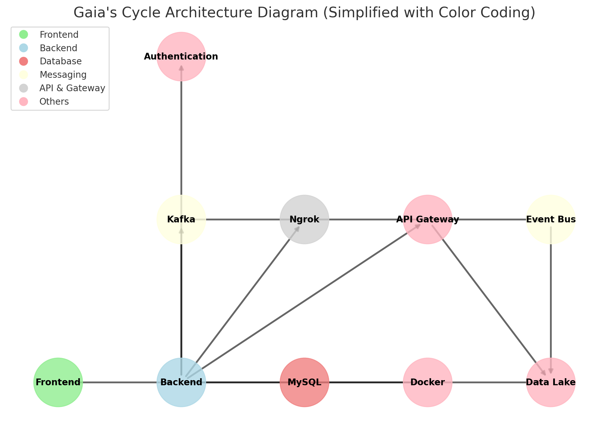

# Gaia's Cycle Architecture Overview

## Architecture Diagram

Below is the simplified architecture diagram of the **Gaia's Cycle** project, which uses color coding to represent different components and their relationships.


*The diagram above illustrates the core components of the Gaia's Cycle project and their relationships.*

``` 
sequenceDiagram
    Users[Users] --> Frontend[Frontend (Bootstrap)]
     Frontend --> Backend[Backend (FastAPI, SQLAlchemy, Pydantic)]
    Backend --> MySQL[MySQL Database]
    Backend --> Kafka[Kafka]
    Backend --> Ngrok[Ngrok]
    Backend --> Docker[Docker]
    Backend --> APIGateway[API Gateway (FastAPI)]
    Kafka --> EventBus[Event Bus (Kafka)]
    EventBus --> DataLake[Data Lake (S3)]
    APIGateway --> DataLake
    MySQL --> DataLake
    Backend --> Authentication[User Authentication (Passlib)]
```


### Legend:
- **Frontend**: Green
- **Backend**: Blue
- **Database**: Red
- **Messaging**: Yellow
- **API & Gateway**: Gray
- **Others**: Pink

## Key Components and Their Relationships

- **Frontend**: Built with **Bootstrap** for a responsive UI, interacting with the **Backend** via API calls.
- **Backend**: Powered by **FastAPI**, **SQLAlchemy**, and **Pydantic** for efficient database interactions, schema validation, and API management.
- **MySQL Database**: Stores user, farm, tower, device, and slot data.
- **Kafka**: Handles event streaming and message queuing between services.
- **Ngrok**: Provides secure tunnels for local development and testing.
- **Docker**: Used to containerize the application and ensure environment consistency.
- **API Gateway**: FastAPI manages all API requests and responses.
- **Event Bus**: Kafka handles asynchronous events between services.
- **Data Lake (S3)**: Stores large datasets, including logs, sensor data, and analytics results.
- **User Authentication**: Managed with **Passlib** for secure password hashing and authentication.

The system is designed to be modular and scalable, allowing for future enhancements and integrations.


## App Flow

### 1. User Interaction with the Frontend
- Users interact with the frontend through a responsive web interface.
- The frontend displays live data, such as crop statuses and sensor readings, and allows users to make decisions based on this information (e.g., adjusting irrigation or adding new crops).
- When a user submits a request (e.g., updating crop information), it is sent to the backend via API calls.

### 2. Backend Processing
- The backend receives the request from the frontend and processes the necessary business logic (e.g., validating input, calculating crop yield predictions).
- It communicates with the database to query or update information (e.g., adding new crop data or updating sensor readings).
- Any real-time sensor data is handled asynchronously, utilizing Kafka to manage the data streams and ensure non-blocking operations.
- After processing, the backend sends the appropriate response back to the frontend.

### 3. Database Operations
- The backend queries or updates the MySQL database for any relevant information (e.g., checking available crop slots or saving new crop data).
- Data retrieval is optimized for speed and accuracy, and relational queries are used to fetch related information, such as crop status, sensor data, and user information.

<!--
## Additional Services and Their Roles

### 1. **Redis**
- Redis is used for caching purposes to improve performance by storing frequently accessed data in memory. For example, the current status of crops and sensors might be cached for quicker retrieval without needing to query the database on each request.

### 2. **Twilio**
- Twilio is used to send notifications to users for critical updates, such as when crop growth reaches a specific stage or if sensor readings fall outside optimal ranges. Notifications are sent via SMS or email to keep users informed.
-->

This architecture ensures that the system is both efficient and scalable, with separate components handling different responsibilities and third-party services augmenting the functionality.
