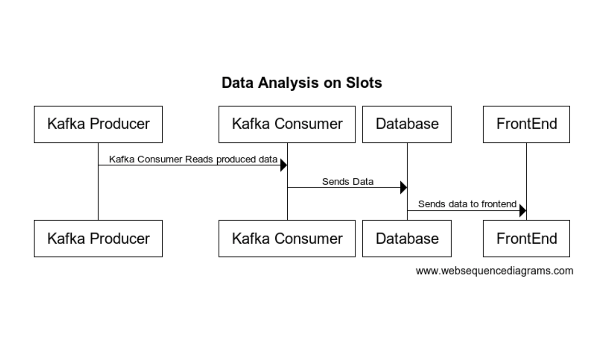

 # Sequence Diagrams

<!-- 
Include:
1. Diagrams for key user flows:
   - User login and authentication process.
   - Data retrieval from the database (e.g., fetching stats or produce information).
2. Highlight each component's role in these flows (frontend, backend, database, third-party services).
3. Tools to generate diagrams (recommendation: Mermaid.js for Markdown integration).
-->

## Data Retrieval (e.g., Stats Fetching)

## Sequence Diagram: Data Analysis Workflow

This diagram illustrates the data flow and interactions between components when a user requests to view statistics. It highlights the role of each component, including the frontend, backend, database, and third-party services, in fetching, analyzing, and presenting the data.

### Steps:

1. **Data Production**:
    - The Kafka Producer generates and streams data to the Kafka Consumer. This could represent real-time data from IoT devices, user interactions, or other sources relevant to the system.

2. **Data Ingestion**:
    - The Kafka Consumer listens to the topic and consumes the data, parsing and processing it as necessary.
    - Once processed, the Kafka Consumer writes the data to the relational database (e.g., MySQL).

3. **Result Presentation**:
    - The results are sent back to the FastAPI backend.
    - The backend prepares these metrics in a structured format (e.g., JSON or rendered HTML) and sends them to the frontend.
    - The frontend displays the metrics to the user through the stats dashboard.

